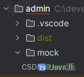

[mockjs使用文档v2.9.6](https://www.npmjs.com/package/vite-plugin-mock/v/2.9.6)

1. 安装插件

```shell
npm i  mockjs -S
npm i vite-plugin-mock@2.9.6
```

2. 配置`vite.config.ts`文件

```shell
export default defineConfig(({ command }) => {
  return {
    plugins: [
      vue(),
      viteMockServe({
        // 保证开发阶段可以使用mock，生产环境禁止开启
        localEnabled: command === 'serve'
      })
    ]
  }
})
```

`defineConfig(({ command })=>{}`箭头函数参照官网写的

关于viteMockServe的配置项信息

```shell
{
supportTs?: boolean; --是否读取ts文件模块，设置为true时不能读取js文件
logger?:boolean; --是否在控制台显示请求日志
mockPath?: string;  --设置模拟数据的存储文件夹，如果不是index.js需要写明完整路径
ignore?: RegExp | ((fileName: string) => boolean);--读取文件时忽略指定格式的文件
watchFiles?: boolean;--是否监视mockPath文件夹内文件的修改
localEnabled?: boolean;--设置是否启用本地 xxx.ts 文件，不要在生产环境中打开它.设置为 false 将禁用 mock 功能
ignoreFiles?: string[]; --读取文件时忽略的文件
configPath?: string;--设置模拟读取的数据条目。 当文件存在并且位于项目根目录中时，将首先读取并使用该文件。 配置文件返回一个数组
prodEnabled?: boolean;--设置打包是否启用 mock 功能
injectFile?: string;--如果生产环境开启了 mock 功能,即prodEnabled=true.则该代码会被注入到injectFile对应的文件的底部。默认为main.{ts,js}。这样做的好处是,可以动态控制生产环境是否开启 mock 且在没有开启的时候 mock.js 不会被打包。如果代码直接写在main.ts内，则不管有没有开启,最终的打包都会包含mock.js
injectCode?: string;--injectCode代码注入的文件,默认为项目根目录下src/main.{ts,js}
}
```

3. 在主目录下创建mock文件夹，里面放置需要mock的数据

  

3. 这里假设需要mock用户的数据，创建`user.ts`文件

```shell
export default [
  {
    url: '/api/user/login',
    method: 'post',
    response: ({ body }) => {
      const { username, password } = body
      if (username === 'admin' && password === 123) {
        return { code: 200, data: { token: '123' }, msg: '操作成功' }
      } else {
        return { code: 500, data: {}, msg: '操作失败' }
      }
    }
  }
]
```

4. 测试mock是否生效

安装好`axios`，然后在`main.ts`文件中测试

```shell
// 测试mockjs
import axios from 'axios'

axios({
  url: '/api/user/login',
  method: 'post',
  data: {
    username: 'admin',
    password: 123
  }
})
```

然后在浏览器中刷新就可以直接看到发送了`login`接口，并返回了mock中的数据
