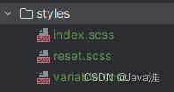

1. 安装插件

```shell
npm install sass --save-dev
```

2. 在src文件夹下创建`styles`文件夹,并创建以下文件



- `index.scss:` scss的入口文件

```shell
// 引入清除默认样式
@import './reset.scss';
```

- `reset.scss:` 清除样式文件

```shell
/**
 * ENGINE
 * v0.2 | 20150615
 * License: none (public domain)
 */

*,
*:after,
*:before {
  box-sizing: border-box;

  outline: none;
}

html,
body,
div,
span,
applet,
object,
iframe,
h1,
h2,
h3,
h4,
h5,
h6,
p,
blockquote,
pre,
a,
abbr,
acronym,
address,
big,
cite,
code,
del,
dfn,
em,
img,
ins,
kbd,
q,
s,
samp,
small,
strike,
strong,
sub,
sup,
tt,
var,
b,
u,
i,
center,
dl,
dt,
dd,
ol,
ul,
li,
fieldset,
form,
label,
legend,
table,
caption,
tbody,
tfoot,
thead,
tr,
th,
td,
article,
aside,
canvas,
details,
embed,
figure,
figcaption,
footer,
header,
hgroup,
menu,
nav,
output,
ruby,
section,
summary,
time,
mark,
audio,
video {
  font: inherit;
  font-size: 100%;

  margin: 0;
  padding: 0;

  vertical-align: baseline;

  border: 0;
}

article,
aside,
details,
figcaption,
figure,
footer,
header,
hgroup,
menu,
nav,
section {
  display: block;
}

body {
  line-height: 1;
}

ol,
ul {
  list-style: none;
}

blockquote,
q {
  quotes: none;

  &:before,
  &:after {
    content: '';
    content: none;
  }
}

sub,
sup {
  font-size: 75%;
  line-height: 0;

  position: relative;

  vertical-align: baseline;
}

sup {
  top: -.5em;
}

sub {
  bottom: -.25em;
}

table {
  border-spacing: 0;
  border-collapse: collapse;
}

input,
textarea,
button {
  font-family: inhert;
  font-size: inherit;

  color: inherit;
}

select {
  text-indent: .01px;
  text-overflow: '';

  border: 0;
  border-radius: 0;

  -webkit-appearance: none;
  -moz-appearance: none;
}

select::-ms-expand {
  display: none;
}

code,
pre {
  font-family: monospace, monospace;
  font-size: 1em;
}
```

- `variable.scss：`scss的全局变量

```shell
// 配置scss全局变量
$color:red
```

3. 在`mian.ts`文件引入`scss`

```
import '@/styles/index.scss'
```

4. 配置`vite.config.ts`文件

```
export default defineConfig({
  plugins: [
    vue()
  ],
  // scss全局变量配置
  css: {
    preprocessorOptions: {
      scss: {
        javascriptEnable: true,
        additionalData: '@import "./src/styles/variable.scss";'
      }
    }
  }
})
```

5. 案例代码

```
<template>
  <div><h1>测试代码</h1></div>
</template>

<script setup lang="ts"></script>

<style scoped lang="scss">
div {
  h1 {
    color: $color;
  }
}
</style>
```

- 由于引入了`reset.scss`清除样式，所以就没有`h1`的效果了，可以把`reset.scss`样式去掉感受效果
- `$color`就是`variable.scss`中配置的全局变量
